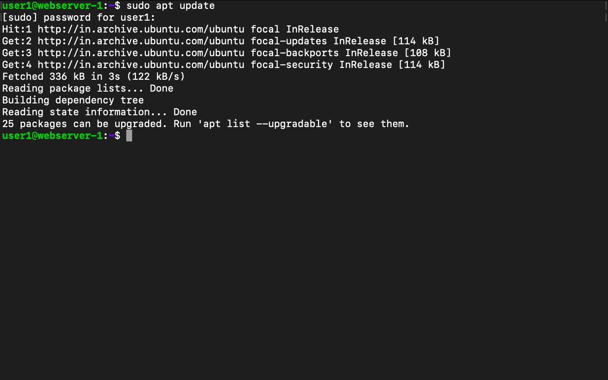
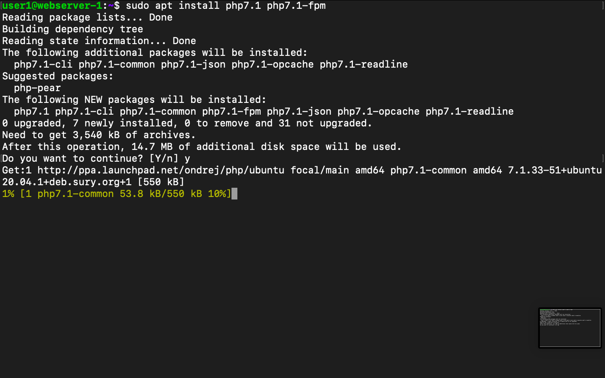
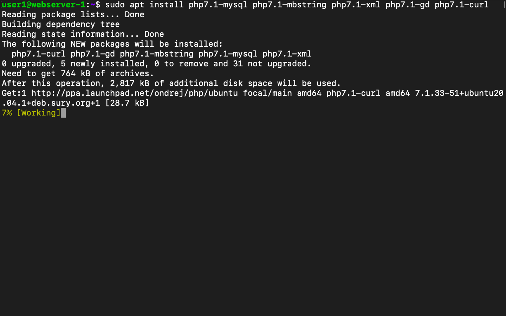
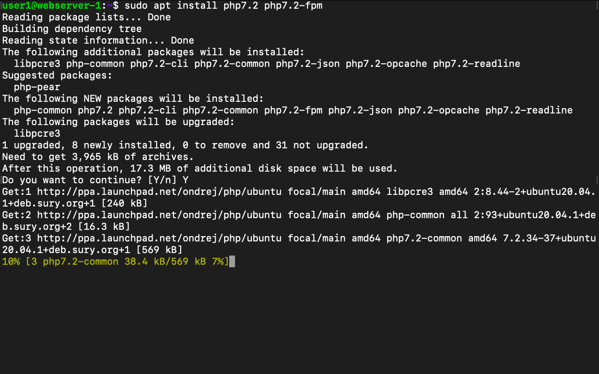
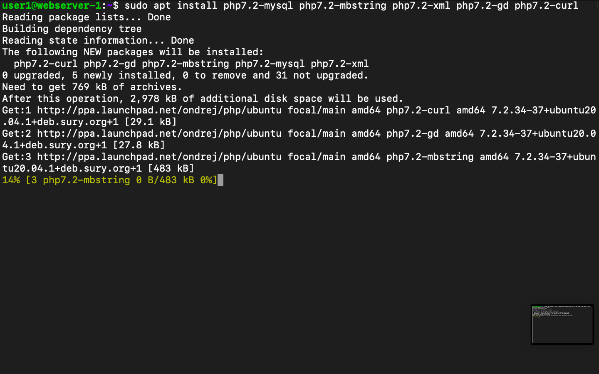
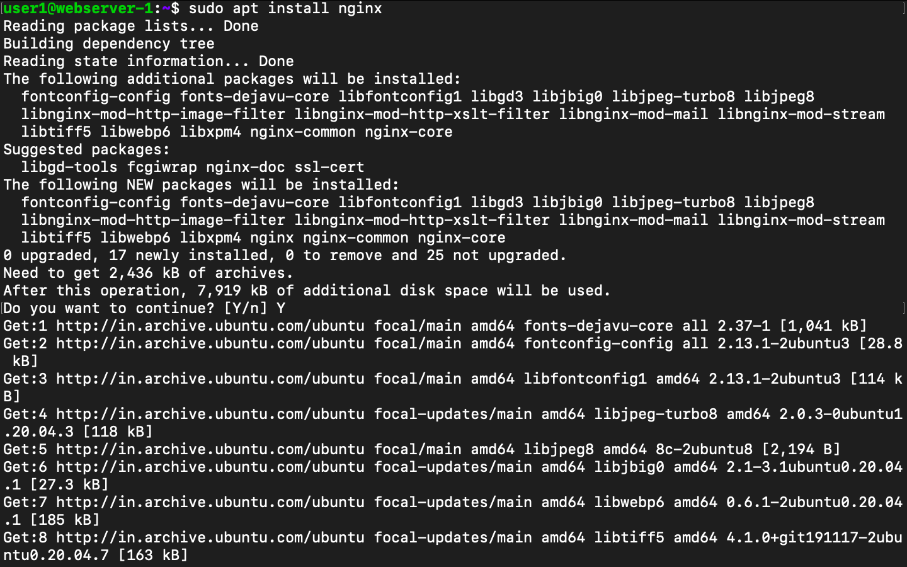
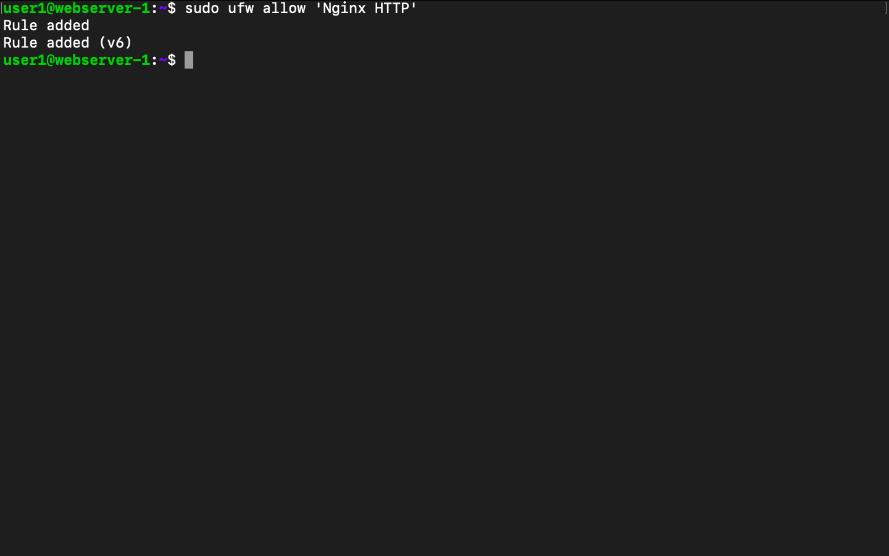
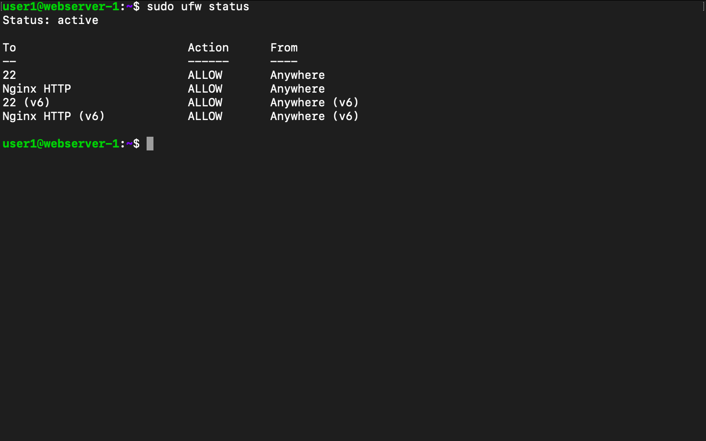
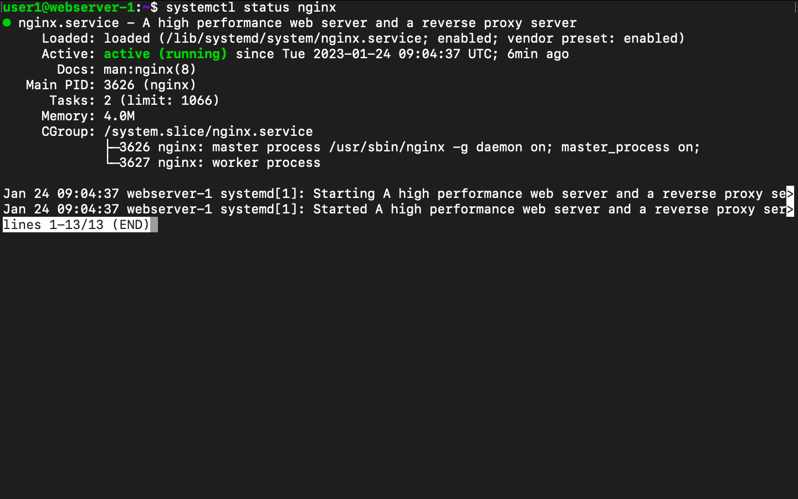

-------------------------------------------------------------------------
How to configure Multiple PHP Versions with an NGINX Server Using php-fpm
-------------------------------------------------------------------------

We can run multiple PHP versions in Ubuntu server with NGINX. If we build applications in different versions of PHPs;  we require multiple PHP versions.

In this example we are going to use php7.1 and 7.2.  We are covering this as we had to support some legacy codebase , you can do the same with new PHP versions as well.

We can start by checking the technologies which we are going to use in this.

    1.PHP : Is an open source server side programming language that is mostly used for web development .
    2.PHP-FPM : It is a service which execute out php code and pass the results back to a web server.
    3.NGINX: Is an open source for web server, it can work in different modes such as , reverse proxy, caching server,     load balance , media run and more.
    4.UBUNTU: Is an open source operating system which provides stable release , regular security updates, speed and vast  amount of packages which is helpful for web applications development. Easy to setup web servers like NGINX, Apache etc. Easily install popular DB systems like MySQL, PostgreSQL etc.

    Here we are going to use the site name as example.com , the domain name we have already publish.

Install PHP Versions:

First we have to install PHP 7.1 using the below mentioned commands.

    sudo apt install software-properties-common -y

    sudo add-apt-repository ppa:ondrej/php

Run update command:

    sudo apt update

Install php 7.1, php-fpm and extensions

    sudo apt install php7.1 php7.1-fpm

    sudo apt install php7.1-mysql php7.1-mbstring php7.1-xml php7.1-gd php7.1-curl

Install php 7.2,php-fpm versions and extensions

    sudo apt install php7.2 php7.2-fpm
    

    sudo apt install php7.2-mysql php7.2-mbstring php7.2-xml php7.2-gd php7.2-curl

Install Nginx

    sudo apt install nginx

Configure the system firewall

    sudo ufw enable 
    sudo ufw allow nginx

    sudo ufw status

Restart nginx service & check the status

    systemctl restart nginx
    systemctl status nginx

Need to create two folders for websites in /var/www as site1 and site2. In site1 we are going to use php 7.1 and in site2 would be php 7.2

Create index.php in both folders and content as given bellow

    <?php phpinfo(); ?>

Create server blocks for site1 and site2 on Nginx

Application with PHP 7.1

    sudo nano /etc/nginx/sites-available/site1.example.com

    server {

        listen 80;
        root /var/www/site1;
        index index.php;
        server_name site1.example.com;
        location ~* \.php$ {

            # With php-fpm unix sockets
            fastcgi_pass unix:/var/run/php/php7.1-fpm.sock;
            include      fastcgi_params;
            fastcgi_param  SCRIPT_FILENAME 
            $document_root$fastcgi_script_name;
            fastcgi_param   SCRIPT_NAME        $fastcgi_script_name;
        }

    }

Application with PHP 7.2

        sudo nano /etc/nginx/sites-available/site2.example.com

        server {

        listen 80;
        root /var/www/site2;
        index index.php;
        server_name site2.example.com;
        location ~* \.php$ {
            # With php-fpm unix sockets
            fastcgi_pass unix:/var/run/php/php7.2-fpm.sock; 
            include      fastcgi_params;
            fastcgi_param  SCRIPT_FILENAME 
            $document_root$fastcgi_script_name;
            fastcgi_param   SCRIPT_NAME        $fastcgi_script_name;

        }

    }

Create link between both file under /etc/nginx/sites-enabled

    sudo  ln -s /etc/nginx/sites-available/site1.example.com /etc/nginx/sites-enabled
    sudo  ln -s /etc/nginx/sites-available/site2.example.com /etc/nginx/sites-enabled 

Restart Nginx

    sudo systemctl restart nginx

Result

Now you will be able to access both sites using a web browser or API inspection tool. request to specific applications will be making use of the corresponding PHP Version as configured.

----------------
SANDEEP CHATHOTH
----------------