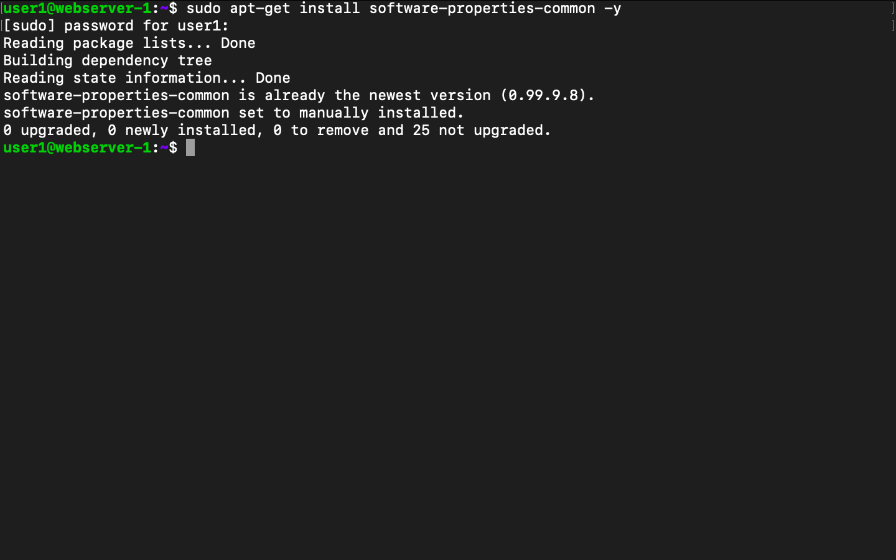

-------------------------------------------------------------------------
How to configure Multiple PHP Versions with an NGINX Server Using php-fpm
-------------------------------------------------------------------------

We can run multiple PHP versions in Ubuntu server with NGINX. If we build applications in different versions of PHPs;  we require multiple PHP versions.

In this example we are going to use php7.1 and 7.2.  We are covering this as we had to support some legacy codebase , you can do the same with new PHP versions as well.

We can start by checking the technologies which we are going to use in this.

    1.PHP : Is an open source server side programming language that is mostly used for web development .
    2.PHP-FPM : It is a service which execute out php code and pass the results back to a web server.
    3.NGINX: Is an open source for web server, it can work in different modes such as , reverse proxy, caching server,     load balance , media run and more.
    4.UBUNTU: Is an open source operating system which provides stable release , regular security updates, speed and vast  amount of packages which is helpful for web applications development. Easy to setup web servers like NGINX, Apache etc. Easily install popular DB systems like MySQL, PostgreSQL etc.

    Here we are going to use the site name as example.com , the domain name we have already publish.

Install PHP Versions:

First we have to install PHP 7.1 using the below mentioned commands.

sudo apt install software-properties-common

sudo add-apt-repository ppa:ondrej/php

Run update command:
sudo apt update

Install php 7.1, php-fpm and extensions

    sudo apt install php7.1 php7.1-fpm

    sudo apt install php7.1-mysql php7.1-mbstring php7.1-xml php7.1-gd php7.1-curl

